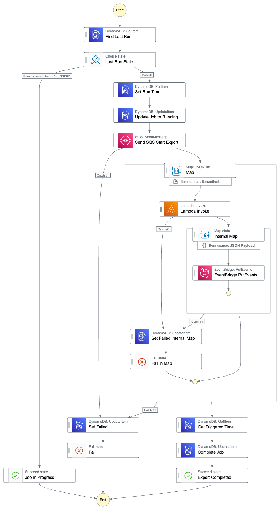

# HealthLake Export Manager

Purpose: Working example of using AWS Step Functions, SQS, Lambda, S3 and EventBridge to manage scheduled exports of FHIR resources in AWS HealthLake.

## State Machine

